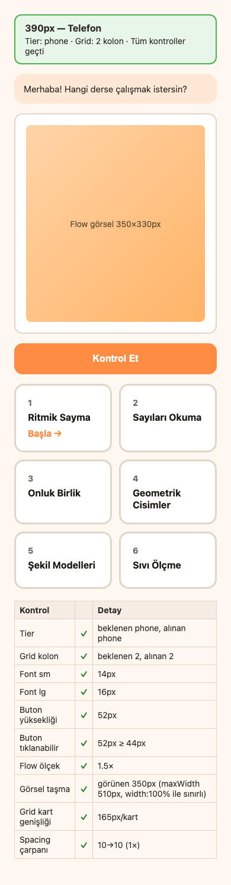
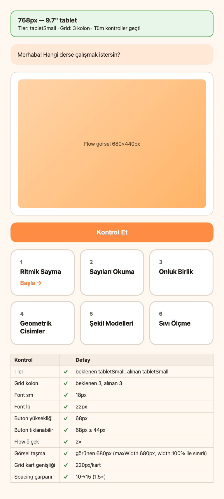
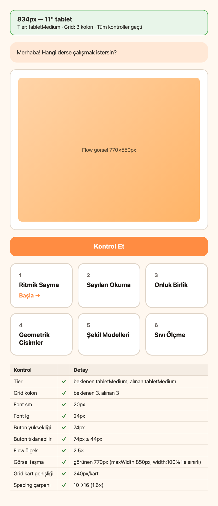
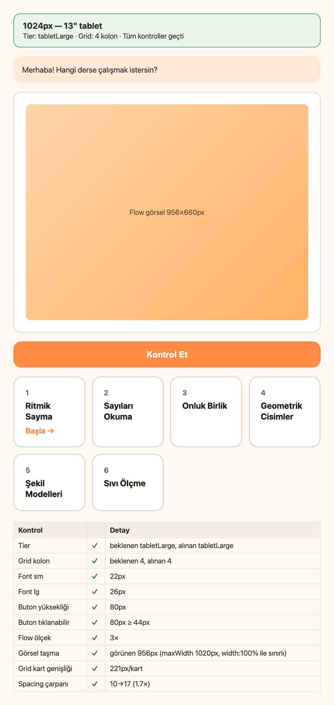

# Responsive Breakpoint Doğrulama Raporu

Tarih: 2026-06-12

> `deviceLayout.ts` mantığı dört hedef genişlikte doğrulandı. Mockup ekran görüntüleri `docs/test-screenshots/` altında.
> Ortam: Xcode/Android SDK bu makinede yok; Expo Go simülatörü yerine otomatik doğrulama + Playwright mockup PNG kullanıldı.

## 390px — Telefon

| Kontrol | Sonuç | Detay |
|---------|-------|-------|
| Tier | ✓ | beklenen phone, alınan phone |
| Grid kolon | ✓ | beklenen 2, alınan 2 |
| Font sm | ✓ | 14px |
| Font lg | ✓ | 16px |
| Buton yüksekliği | ✓ | 52px |
| Buton tıklanabilir | ✓ | 52px ≥ 44px |
| Flow ölçek | ✓ | 1.5× |
| Görsel taşma | ✓ | görünen 350px (maxWidth 510px, width:100% ile sınırlı) |
| Grid kart genişliği | ✓ | 165px/kart |
| Spacing çarpanı | ✓ | 10→10 (1×) |

**Genel:** GEÇTİ

## 768px — 9.7" tablet

| Kontrol | Sonuç | Detay |
|---------|-------|-------|
| Tier | ✓ | beklenen tabletSmall, alınan tabletSmall |
| Grid kolon | ✓ | beklenen 3, alınan 3 |
| Font sm | ✓ | 18px |
| Font lg | ✓ | 22px |
| Buton yüksekliği | ✓ | 68px |
| Buton tıklanabilir | ✓ | 68px ≥ 44px |
| Flow ölçek | ✓ | 2× |
| Görsel taşma | ✓ | görünen 680px (maxWidth 680px, width:100% ile sınırlı) |
| Grid kart genişliği | ✓ | 220px/kart |
| Spacing çarpanı | ✓ | 10→15 (1.5×) |

**Genel:** GEÇTİ

## 834px — 11" tablet

| Kontrol | Sonuç | Detay |
|---------|-------|-------|
| Tier | ✓ | beklenen tabletMedium, alınan tabletMedium |
| Grid kolon | ✓ | beklenen 3, alınan 3 |
| Font sm | ✓ | 20px |
| Font lg | ✓ | 24px |
| Buton yüksekliği | ✓ | 74px |
| Buton tıklanabilir | ✓ | 74px ≥ 44px |
| Flow ölçek | ✓ | 2.5× |
| Görsel taşma | ✓ | görünen 770px (maxWidth 850px, width:100% ile sınırlı) |
| Grid kart genişliği | ✓ | 240px/kart |
| Spacing çarpanı | ✓ | 10→16 (1.6×) |

**Genel:** GEÇTİ

## 1024px — 13" tablet

| Kontrol | Sonuç | Detay |
|---------|-------|-------|
| Tier | ✓ | beklenen tabletLarge, alınan tabletLarge |
| Grid kolon | ✓ | beklenen 4, alınan 4 |
| Font sm | ✓ | 22px |
| Font lg | ✓ | 26px |
| Buton yüksekliği | ✓ | 80px |
| Buton tıklanabilir | ✓ | 80px ≥ 44px |
| Flow ölçek | ✓ | 3× |
| Görsel taşma | ✓ | görünen 956px (maxWidth 1020px, width:100% ile sınırlı) |
| Grid kart genişliği | ✓ | 221px/kart |
| Spacing çarpanı | ✓ | 10→17 (1.7×) |

**Genel:** GEÇTİ

---

## Claude'a not

### Test yöntemi
- `npm run test:responsive` → `verify-responsive-breakpoints.mjs` + `capture-responsive-screenshots.py`
- Bu makinede **Xcode/Android SDK yok**; gerçek Expo Go simülatörü çalıştırılamadı
- Yerine: `deviceLayout.ts` ile senkron saf JS doğrulama + TopicListScreen grid mantığını yansıtan HTML mockup + Playwright PNG

### Sonuç özeti (4/4 GEÇTİ)

| Genişlik | Tier | Grid | Buton | Font lg | Flow | Görsel |
|----------|------|------|-------|---------|------|--------|
| 390px | phone | 2 | 52px | 16px | 1.5× | 350px (sınırlı) |
| 768px | tabletSmall | 3 | 68px | 22px | 2.0× | 680px |
| 834px | tabletMedium | 3 | 74px | 24px | 2.5× | 770px |
| 1024px | tabletLarge | 4 | 80px | 26px | 3.0× | 956px |

### Görsel taşma notu
`FlowImage` `maxWidth` + `width:100%` kullanıyor; telefonda maxWidth 510px olsa da görünen genişlik içerik alanına (350px) sığar.

### Manuel Expo Go doğrulama (önerilen)
Patron cihazında şu simülatörlerle tekrar kontrol:
- iPhone 14 (390px) — 2 kolon
- iPad 9.7" (768px) — 3 kolon
- iPad Air 11" (834px) — 3 kolon
- iPad Pro 13" (1024px) — 4 kolon

Ekran görüntüleri: `docs/test-screenshots/responsive-{390,768,834,1024}.png`
